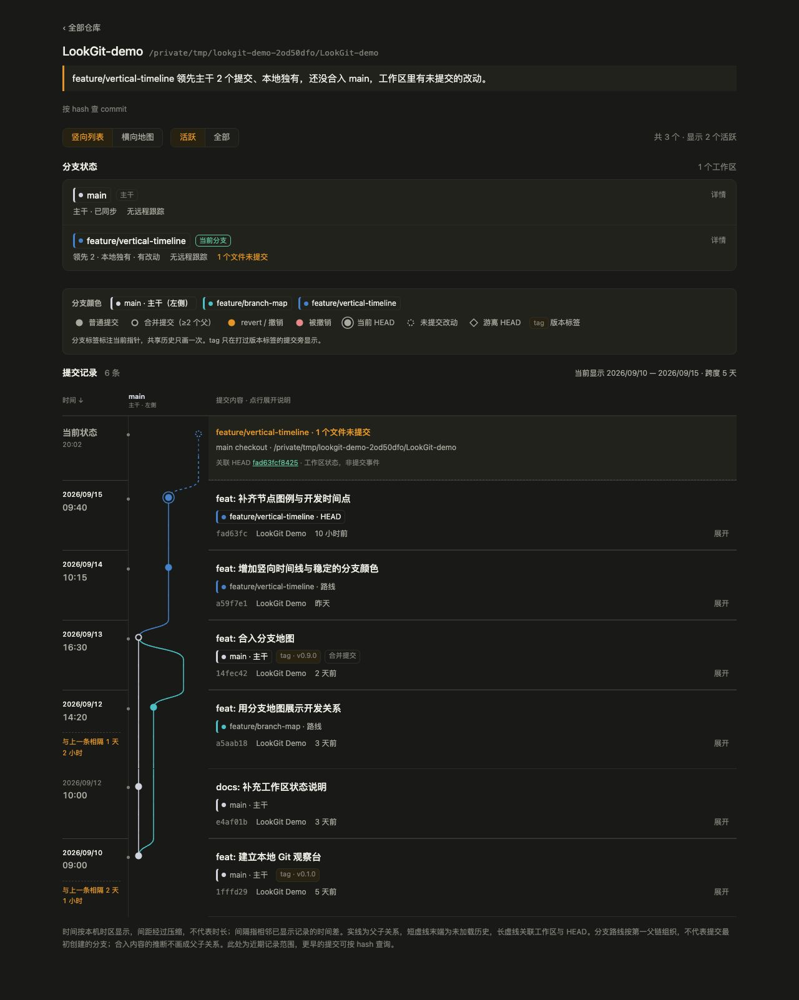

# LookGit

**看懂本地 Git 开发状态。** 一个运行在本机的只读仪表盘，适合同时管理多个项目、使用 worktree，或观察 AI coding agent 的开发进展。

[English](README.en.md) · [下载 v1.0.0](https://github.com/elfish2025-crypto/LookGit/releases/tag/v1.0.0) · [MIT License](LICENSE)



*截图使用虚构的演示仓库，不包含真实项目数据。*

## 能做什么

- **多仓库总览**：递归发现所选文件夹中的 Git 仓库，按需要留意、已同步、空闲分类。
- **分支与工作区**：查看主干、领先/落后、未提交文件数、上游跟踪与本地 worktree。
- **竖向时间线**：主干固定在左侧，分支配色稳定，日期与时间常驻，提交说明就近展开。
- **完整标记**：普通提交、合并、revert、被撤销、HEAD、未提交、游离 HEAD 和 tag。
- **横向分支地图**：保留时间轴缩放、拖动与节点详情。
- **按 hash 查提交**：查询已加载窗口之外的提交及其本地分支包含关系。

LookGit 不提供 commit、checkout、merge、reset、push 或删除分支操作。它只修改自己的监视目录配置；Git 采集关闭可选锁，避免 `status` 顺带刷新索引。

## 快速开始

需要 **Node.js 22.11 或更高版本、npm 和 Git**。目前界面为中文。macOS 是主要交互验证平台；Linux 可通过终端运行。没有打包成无需 Node.js 的原生应用。

```sh
git clone https://github.com/elfish2025-crypto/LookGit.git
cd LookGit
npm ci
npm run build
npm start
```

打开 <http://localhost:5179>，点击「加文件夹」，输入仓库目录或包含多个仓库的父目录的绝对路径。首次启动为空，不自动扫描文件夹。按 `Ctrl+C` 停止服务。

macOS 也可双击项目中的 `start-lookgit.command`：首次安装依赖、构建并打开浏览器。

### 下载发行包

在 [Releases](https://github.com/elfish2025-crypto/LookGit/releases) 下载 `LookGit-v1.0.0.tar.gz`，解压后运行 `npm ci`、`npm start`。发行包包含已构建的前端，仍需要 Node.js 和 Git。GitHub 自动生成的 Source code 包需要另外运行 `npm run build`。

`SHA256SUMS.txt` 用于校验发行包内容；它是完整性校验，不是代码签名。

### 运行选项

| 选项 | 默认值 | 用途 |
| --- | --- | --- |
| `PORT` | `5179` | 本机 HTTP 端口 |
| `LOOKGIT_DATA_DIR` | `~/.lookgit` | 保存 `config.json` 的目录，可用于隔离演示或测试 |

```sh
PORT=5189 npm start
```

服务固定监听 `127.0.0.1`，校验 Host/Origin，并拒绝跨站浏览器请求。它没有账号或认证系统，请勿通过反向代理、端口转发或公共服务器暴露。参见 [安全说明](SECURITY.md)。

## 如何理解数据

- 仓库与分支状态来自本机 Git。**不自动 fetch**，推送状态取决于本地已有的远程跟踪引用，可能落后于 GitHub。
- 分支已合入的 ancestry 结果与「可能已合入」的内容比对推断分开显示。
- 时间线只展示近期窗口及必要连接点；跨天间隔指相邻已显示记录，压缩后的行距不等于实际时长。
- 分支路线按第一父链组织；Git 不记录每次提交最初在哪个分支创建，共享历史只画一次。
- 被撤销不等于代码一定有缺陷；只有扫描到关联 revert 的记录才会被标记。
- 不包含 AI 模型、云端上传或遥测。安装依赖时 npm 需要联网；运行时的 Git 观察在本地完成。
- MCP、Agent 笔记、已删除分支历史存档属于后续规划，未包含在 v1.0.0 中。

## 开发

```sh
npm ci
npm run dev       # API :5179，Vite :5178
npm run check     # 类型检查、测试、前端构建
```

前端位于 `web/src/`，只读 Git 采集位于 `engine/`，本机 API 与配置位于 `server/`，共享类型位于 `shared/`。测试使用临时 Git 仓库和独立配置目录，不修改个人仓库。

构建发行包：提交准备发布的文件后运行 `npm run package:release`，产物位于 `release/`。打包脚本只包含当前 Git 已跟踪的文件及构建产物，不携带个人配置或本地检查截图。

[贡献指南](CONTRIBUTING.md) · [更新日志](CHANGELOG.md) · [历史设计与后续规划](design/local-git-observer-design.md)

## License

[MIT](LICENSE) © 2026 elfish2025-crypto
